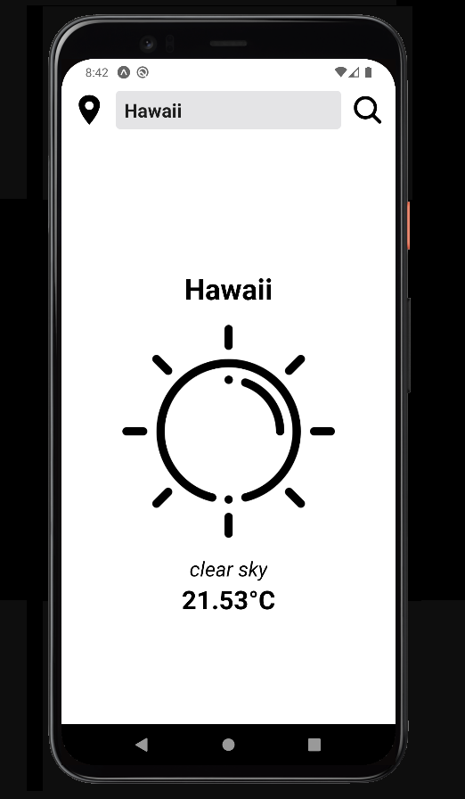
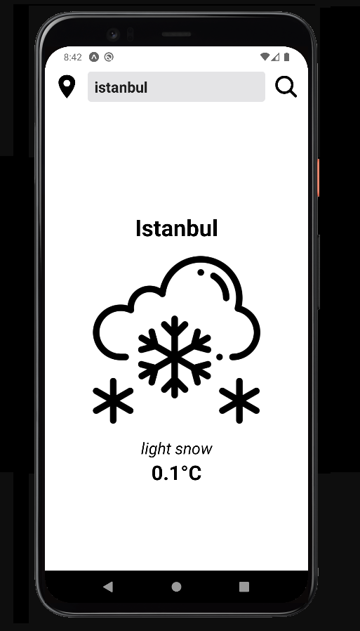

# Minimalist Weather App

  

## Getting Started
These instructions will get you a copy of the project up and running on your local machine for development and testing purposes. If you want to make a change, please use the develop branch and open a pull request.

## Prerequisites
The things you will need in order to use the app and how to install them.

- [Node 12 LTS or greater installed](https://nodejs.org/en/download/)
- [Expo CLI](https://github.com/expo/expo)

### How to use
First you need to download project.
```
git clone 
```
After you build you can install dependencies.
```
cd minimalist-weather-app
npm install
```
Now you can start app
```
expo start  # you can also use: npm start
```

## Author
* **Kaan Yarayan** - [Github](https://github.com/rknyryn)